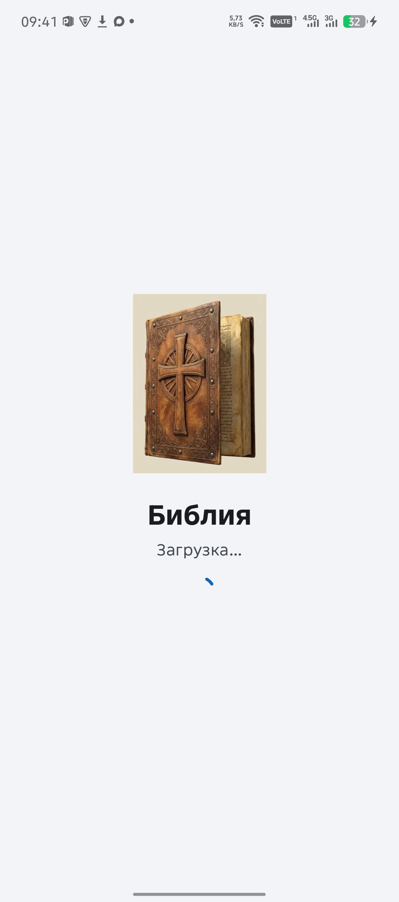
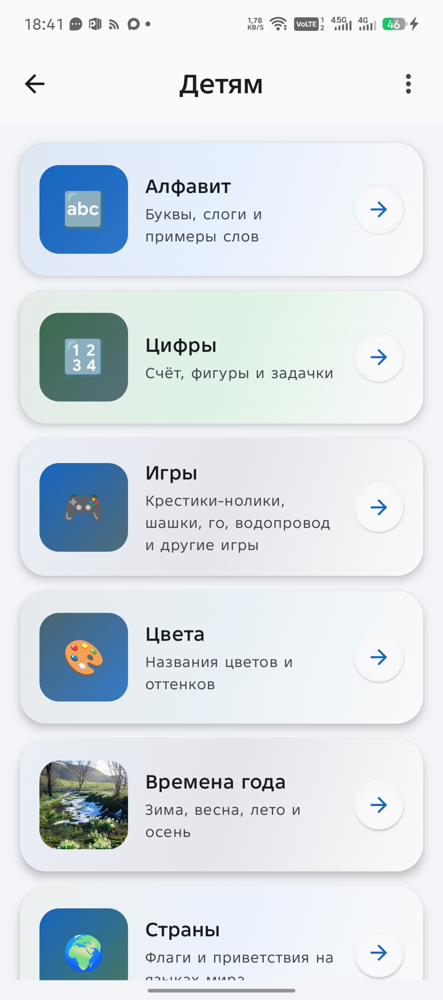
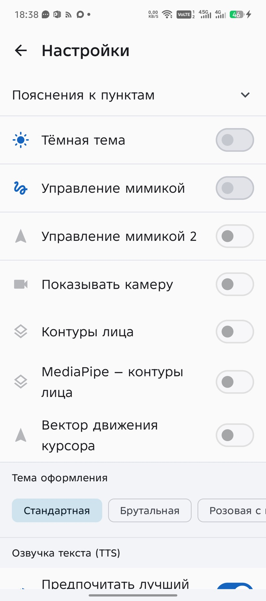
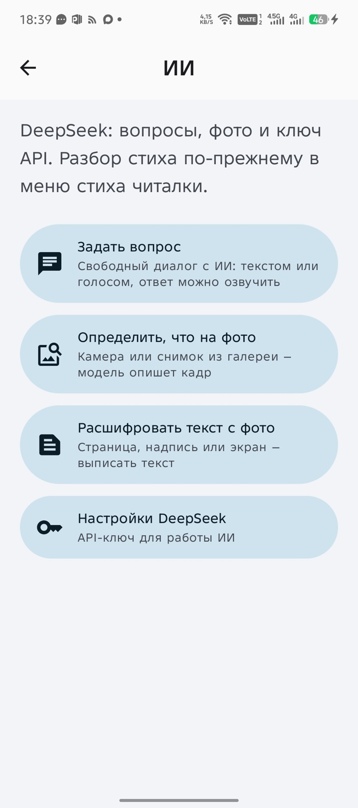

# Bibleapp

Библия для смартфона: чтение, озвучка, изучение, заметки, медиа, детский раздел и многое другое — всё в одном приложении.

**Минимальная версия Android:** 11.

## Скачать

**[Скачать Bible.apk](https://github.com/ValentinK2410/Bibleapp/releases/latest/download/Bible.apk)**

Страница: [Releases](https://github.com/ValentinK2410/Bibleapp/releases/latest)

На телефоне разрешите установку из неизвестного источника, затем откройте файл.

**Что нового и что исправлено:** [CHANGELOG.md](CHANGELOG.md)

## Как выглядит

Книги и стих дня · главы · читалка

Медиа · видео · плейлисты

Аудио · детям · настройки · ИИ

---

## Что уже реализовано

### Чтение Библии

- Выбор книг сеткой или списком, главы и стихи, стих дня
- Быстрый переход к книге и главе из читалки
- Переводы (офлайн): **Синодальный**, **Новый русский**, **РБО**, **Кулаковых**, **WEB (англ.)**, **Подстрочный (Винокуров)**
- Свои цвета подсветки вкладок переводов
- На экране книг и глав — цветные точки, если у перевода есть **таймкоды озвучки** (все переводы сразу, не только открытый). Долгое нажатие показывает список этих переводов
- Масштаб текста, светлая и тёмная тема
- Оформление читалки: стандартное, брутальное, розовое, небо и ромашки, луг и птицы, папирус, кожаный свиток
- Подстрочник: слова, морфология, Стронг, озвучка слова / стиха / главы
- Семантическая подсветка слов (готовые группы и свои правила)
- Выделение фрагмента: цвет фона, цвет текста, подчёркивание, медиа к выделению
- Закладка, заметка, вложение и комментарий к стиху
- Копирование и отправка стиха
- Сравнение **двух или трёх** переводов в окнах: синхронно или раздельно, обмен панелями

### Озвучка

- Дикторы: Бондаренко, Козлов, Ефимов, Свет на Востоке, Новый русский перевод, РБО, Кулаковых, WEB, иврит (ВЗ), греческий (НЗ)
- Воспроизведение главы, скорость, «подряд глав», таймер сна
- Скачивание озвучки всей Библии, отдельно ВЗ на иврите и НЗ на греческом
- **Редактор таймкодов**: синхронизация текста с аудио, воспроизведение в читалке, обмен проектами

### Изучение

- Лист «Изучение» в читалке: комментарии, сравнение переводов стиха, перекрёстные ссылки, Стронг
- Комментарии (в том числе с studybible.ru): Лопухин, Генри, МакАртур, Златоуст, Баркли и другие
- Офлайн-загрузка материалов изучения
- Словарь Стронга (иврит H… / греческий G…)
- Словарь тематической подсветки: встроенные оси (свет/тьма, добро/зло и др.) и свои слова
- Песочница ивритского слова из подстрочника
- Изучение языков: английский, иврит, греческий, арабский — интервальные карточки, словарь, загрузка пакетов
- План «Прочитай Библию за год» (365 дней, «догнать», напоминание)
- Исторические **карты** Ветхого и Нового Завета (скачивание офлайн, зум)
- **Родословная**: поиск персонажей, дерево, путь между людьми, переход к стихам

### Поиск, закладки, история, заметки

- Поиск по текущему переводу (вся Библия / ВЗ / НЗ / книга), история запросов
- Закладки с тегами
- История чтения: тепловая карта, журнал «стих за стихом»
- Заметки: форматирование, привязка к Писанию, ссылки на стихи с озвучкой
- ИИ в заметке: исправить текст, улучшить, простым языком

### Коран и другие тексты

- Коран: 114 сур, арабский текст, транслитерация, смысловой перевод (Кулиев)
- Поиск по переводу, история чтения
- Озвучка: TTS и MP3 Мишари аль‑Афаси (аят / сура / все суры)
- Тафсир ас-Саади и Ибн Касира (офлайн-загрузка)
- Арабская песочница (разбор слов)
- Раздел «Другие книги»: Коран открывается оттуда; прочие внеканонические тексты — заготовка

### ИИ (DeepSeek)

- Вопрос в диалоге (быстрый / глубокий / с поиском в интернете)
- Отправка ответа в микроблог
- Распознать, что на фото; расшифровать текст с фото
- Вопрос по стиху из читалки
- Настройки API-ключа

### GigaChat

- Отдельный раздел в главном меню: вопрос, определить фото, расшифровать текст с фото, настройки
- Чаты хранятся на телефоне, отдельно от DeepSeek
- Диалог с моделью **GigaChat-3-Ultra** (Freemium для физлиц): текст или голос в приложение, отвечает GigaChat, не ассистент телефона
- Authorization Key из Sber Studio, проверка доступа к API

### Каталог медиа

- **Микроблог**: лента, посты, фото (обрезка, место в тексте), заголовок, своё имя блога
- **Картинки**: галерея, камера, поиск, привязка к стихам
- **Для музыканта**: ноты, метроном, тюнер гитары и скрипки
- **Песнопение**: тексты, теги, аудио и видео, таймкоды строк, импорт с HolyChords / Fonki, обмен ZIP
- **Видео и аудио**: библиотека, плейлисты, загрузка по ссылке, прогресс прослушивания, обмен пакетами

### Контакты, карта, церковь

- Свои контакты: телефон, почта, день рождения, координаты; импорт из телефонной книги
- **Мои путешествия**: карта (Яндекс), GPS, маршруты, геозоны, история поездок, уведомления, координаты по SMS
- **Моя церковь**: участники (добавление и правка). Бухгалтерия, приказы, протоколы, справки — пока заглушки

### Детям

- Алфавит, цифры, цвета, времена года, страны, животные, рыбы, змеи, насекомые, деревья, растения
- Свои альбомы с фото и звуком
- Игры: крестики-нолики, шашки, го, водопровод
- Азбука: уроки букв и слогов, «найди букву», библейские словесные игры
- Цифры: счёт, фигуры, таблица умножения, задачи

### Настройки и обмен

- Порядок пунктов главного меню
- TTS: скорость, тон, проверка
- Управление мимикой (прокрутка и жесты лицом через камеру)
- Резервная копия ZIP: настройки, закладки, история, заметки, медиа, песни, таймкоды, озвучка и др.
- «Поделиться моим приложением» (пакет с APK и данными)
- Сеть и регион

### Доступность

- Управление мимикой: прокрутка стихов, тапы и «Назад» жестами лица (камера)

---

## Экспериментальный раздел

Черновики, не основной сценарий чтения:

- камера: рисование руками, управление жестами, сравнение ML Kit и MediaPipe
- звонки и SMS, сценарии реакций на входящие SMS
- лаборатории датчиков и звука, сканер Wi‑Fi
- OBD-II (ELM327) для автомобиля

---

## Что ещё не выведено пользователю

- Файлы Бхагавад-гиты лежат в приложении, отдельного экрана нет
- В «Моя церковь» кроме участников разделы пустые
- «Другие книги» кроме Корана — заготовка
